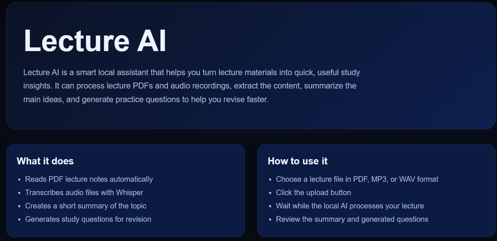
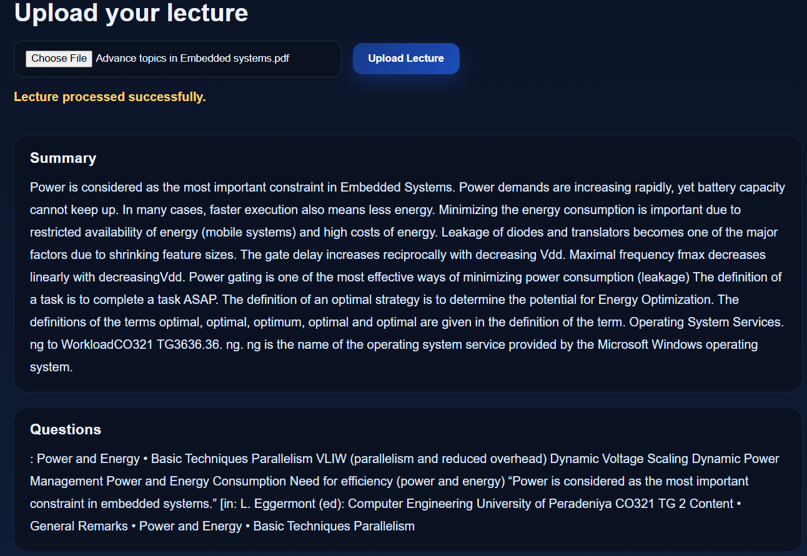

# Mini Projects

## 1. Lecture-AI

### Project status


### Requirements

- Python 3.10+
- Flask
- Torch
- Transformers
- OpenAI Whisper
- PyMuPDF
- A browser to open the frontend

### Quick Start

```bash
# 1. Start backend
cd "d:\Mini-Projects\Lecture-AI\backend"
C:\Python313\python.exe app.py

# 2. Start frontend in another terminal
cd "d:\Mini-Projects\Lecture-AI\frontend"
C:\Python313\python.exe -m http.server 8000

# 3. Open in browser
http://127.0.0.1:8000
```

### Purpose

Lecture-AI is a local study assistant that helps students turn lectures into useful revision materials. It accepts lecture PDFs and audio files, extracts the content, summarizes the main ideas, and generates study questions to make revision faster and easier.

This project is useful for students and learners who want to:

- review class material quickly
- convert lectures into readable notes
- generate practice questions automatically
- work offline without paid AI APIs

### Features

- 📄 Accepts lecture PDFs as input
- 🎤 Accepts lecture audio files such as MP3 and WAV
- 📝 Extracts text from PDF documents automatically
- 🗣️ Converts audio to text using Whisper AI
- 🧠 Summarizes lecture content with a local AI model
- ❓ Generates questions from the lecture content
- 🌐 Provides a simple web interface for uploading lectures
- 🔒 Runs locally without needing paid services

### Technologies used

- Python
- Flask for the backend API
- HTML, CSS, and JavaScript for the frontend
- PyMuPDF for extracting text from PDF lectures
- OpenAI Whisper for converting audio to text
- Hugging Face Transformers for local AI summarization and question generation
- Torch for running the local machine learning models

### Project architecture

The project is organized into two main parts:

- Backend: handles file upload, file detection, PDF extraction, audio transcription, summarization, and question generation
- Frontend: provides the upload interface and displays the generated summary and questions

Flow:

1. A student uploads a PDF or lecture audio file from the browser.
2. The Flask backend receives the uploaded file.
3. The backend identifies the file type.
4. The lecture content is processed locally with AI models.
5. The final summary and questions are returned to the frontend.
6. The result is displayed on the page for review.

### How it helps students

Lecture-AI is designed to reduce the effort of manual revision. Instead of reading long lecture files from scratch, students can quickly:

- get a clear summary of key points
- transform audio lectures into text
- review important concepts faster
- prepare for quizzes and exams with generated questions

This makes it a practical local learning tool for study sessions, revision, and quick content review.

### Project demo flow

```text
User uploads lecture file
        |
        v
Frontend sends file to Flask backend
        |
        v
Backend detects file type
        |
        +--> PDF --> Extract text
        |
        +--> MP3/WAV --> Whisper transcribes audio
        |
        v
Local AI summarization model creates summary
        |
        v
Local AI question-generation model creates questions
        |
        v
Frontend displays summary and questions
```

### How it works

1. The user uploads a lecture file in PDF, MP3, or WAV format.
2. The Flask backend receives the file and saves it in the uploads folder.
3. If the file is a PDF, text is extracted from it.
4. If the file is audio, Whisper transcribes the speech into text.
5. The content is summarized using a local open-source model.
6. Question generation is performed using another local model.
7. The frontend displays the summary and questions for the user.

### Troubleshooting

- If the backend does not start, make sure Python is installed and the project dependencies are available.
- If the browser cannot connect to the backend, confirm that the Flask server is running on port 5000.
- If the app does not recognize the uploaded file, use a PDF, MP3, or WAV file.
- If the AI is slow on the first run, the model weights are being downloaded locally; this can take a few minutes.
- If there is an issue with audio transcription, try a shorter or clearer audio file.
- If the summary is too short or incomplete, use a longer lecture file with more content.

<!-- ### Run the project

1. Start the backend:
   cd "d:\Mini-Projects\Lecture-AI\backend"
   C:\Python313\python.exe app.py

2. Start the frontend:
   cd "d:\Mini-Projects\Lecture-AI\frontend"
   C:\Python313\python.exe -m http.server 8000

3. Open:
   http://127.0.0.1:8000 -->

### Screenshots





---
